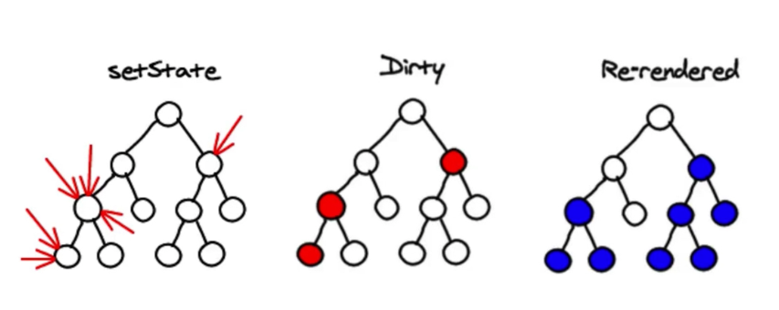
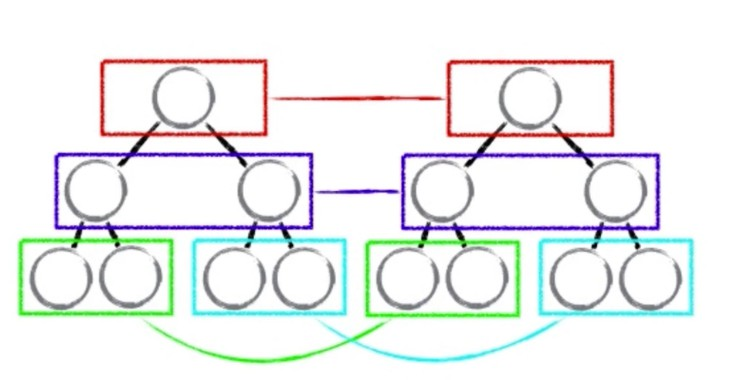

# littleVdom

>通过造轮子来提高自己对于一些优秀开源项目的理解，比如说virtual dom，vue等。

## 操作DOM更新的三个方案
第一种方案：
- 1.state数据
- 2.jsx模板
- 3.数据+模板结合，生成真实的DOM，来显示
- 4.state发生改变
- 5.数据+模板结合，生成真实的DOM，替换原始的DOM

缺陷： 
第一次生成一个完整的DOM片段
第二次生成一个完整的DOM片段
第二次的DOM替换第一次的DOM，非常耗性能

第二种方案：
- 1.state数据
- 2.jsx模板
- 3.数据+模板结合，生成真实的DOM，来显示
- 4.state发生改变
- 5.数据+模板结合直接生成真实的DOM，并不直接替代原始的DOM
- 6.新的DOM（DocumentFragment）和 原始的DOM作对比，找差异
- 7.找到input框发生的改变
- 8.只用新的DOM中的input元素，替代掉老的DOM中的input元素

缺陷： 性能的提升并不明显

第三种方案：
- 1.state数据
- 2.jsx模板
- 3.数据+模板结合，生成虚拟DOM（虚拟DOM是一个js对象，用了描述真实DOM）损耗了性能
【'div', {id: 'abc'}, ['span', {}, 'hello world']
- 4.用虚拟DOM的结构生成真实的DOM，来显示
<div id='abc'><span>hello world</span></div>
- 5.state发生改变
- 6.生成新的虚拟DOM
【'div', {id: 'abc'}, ['span', {}, 'bye bye']】
- 7.比较原始虚拟DOM和新的虚拟DOM的叙别，找到区别的内容
- 8.直接操作DOM，改变span的内容。

优点：
- 1.性能提升了
- 2.它使得跨端应用得以实现。React Native

diff算法
- 1.setState使用异步函数是为了把多次setSate合并成一次，节约性能。

- 2.diff算法实际上是同层比对虚拟DOM的算法,只要对比一层不同，就删除下面的，用新的虚拟DOM替换，这样可以节约比对时间，节约性能。

- 3.循环列表中，li里要带key值否则会警告，这个问题在vue中也存在, 考虑到虚拟DOM中diff，所以不要用index作为key值，而要用item。

## 组成

虚拟DOM+dom-diff算法

## 生成项目
```
npm install -g create-react-app
create-react-app littleVdom
cd littleVdom
npm start
```
TODO:

- [ ] 存在的问题（后续）

    - 平级元素之间有互换  导致重新渲染
    - 新增节点也不会更新

- [ ] 写测试代码
- [ ] 引入CommonJS、AMD、CMD
